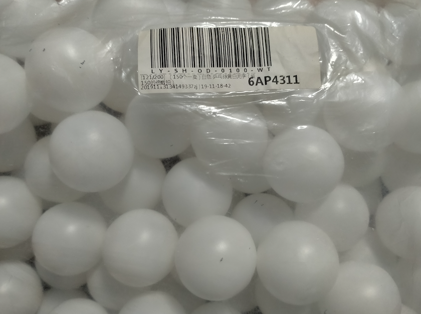

# pingPongClock
Ping pong ball diffusers on LED strips to form a digital clock.

I followed the build instructions from here [https://www.instructables.com/Ping-Pong-Ball-LED-Clock/](https://www.instructables.com/Ping-Pong-Ball-LED-Clock/).

Whole software fits on an Arduino (ATmega328P) Nano. Sketch compiles (without scrolling text support) to:
- Sketch uses 10236 bytes (33%) of program storage space. Maximum is 30720 bytes.
- Global variables use 1807 bytes (88%) of dynamic memory, leaving 241 bytes for local variables. Maximum is 2048 bytes.

Build instructions from https://www.instructables.com/Ping-Pong-Ball-LED-Clock/
The following foreground and background modes can be mixed and matched!

Foreground Modes:
- `T`: Single colour time mode
- `R`: Scrolling rainbow time mode
- `N`: No time
- is_slanted: Option to use slanted digits or original digits (from https://www.instructables.com/Ping-Pong-Ball-LED-Clock/)

Background Animation Modes:
- `R`: Scrolling rainbow background
- `B`: No background
- `T`: Twinkle
- `F`: Fireworks
- `W`: Thunderstorm
- `H`: Firepit (works well with single colour time mode set to a light teal)

Improvements:
- Use a hardware RTC rather than use software
- Implement scolling text
- Use FastLED colour palettes
- Attach light sensor and auto-adjust FastLED brightness
- Attach PIR motion sensor and turn on display when there is someone to look at it
- Attach temperature/humidity/pressure sensor and display stats
- Connect to Wifi (e.g. using an ESP32)

